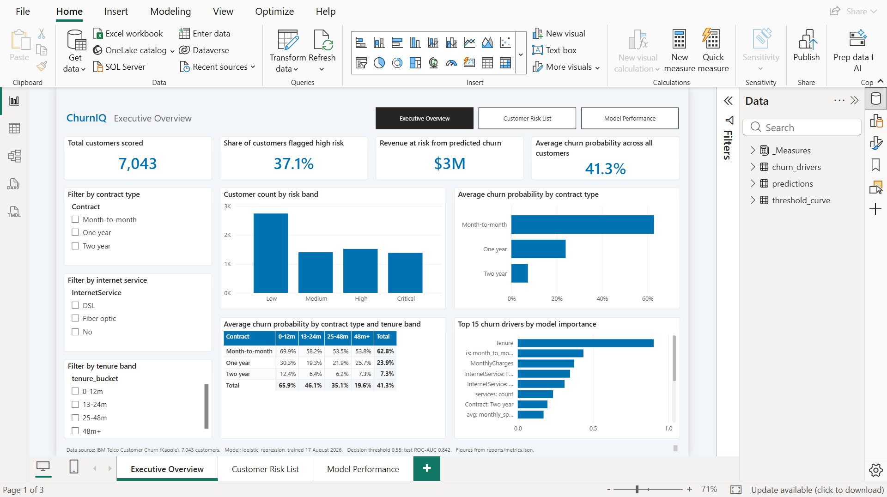
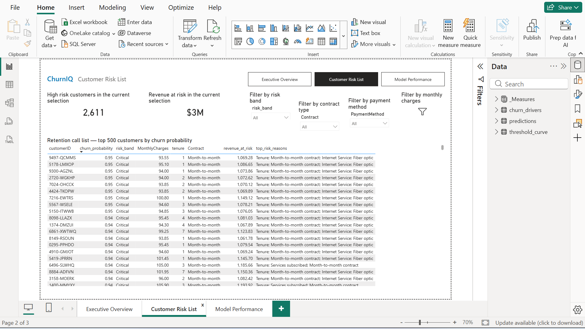
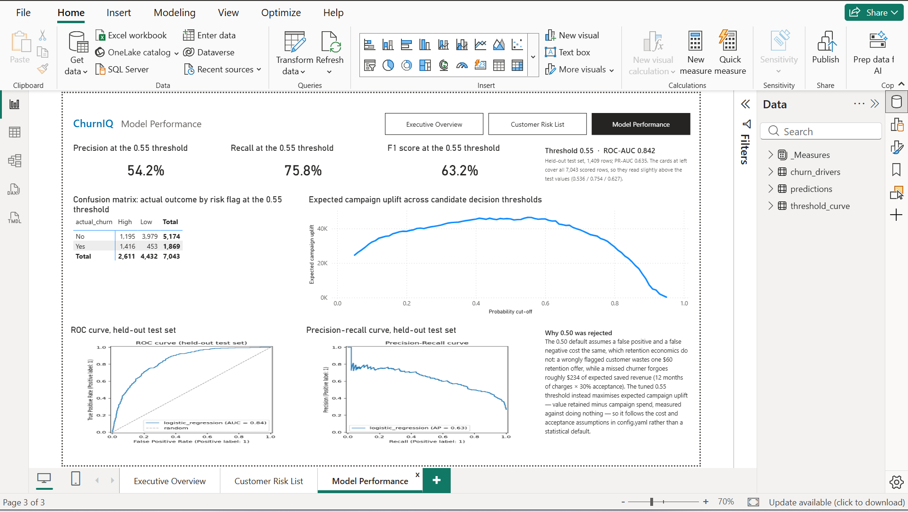
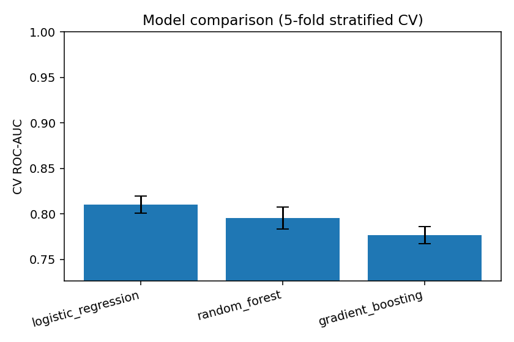
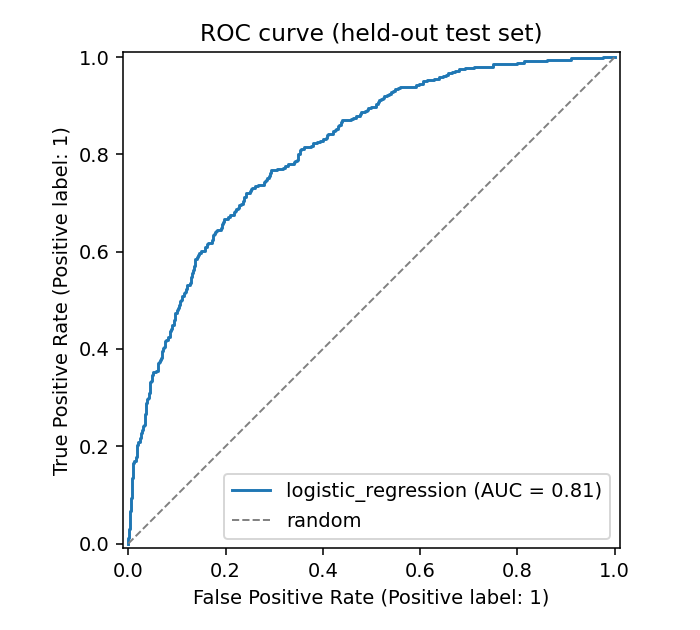
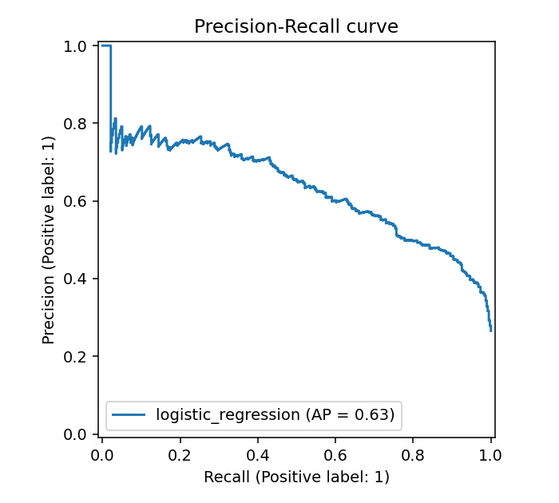
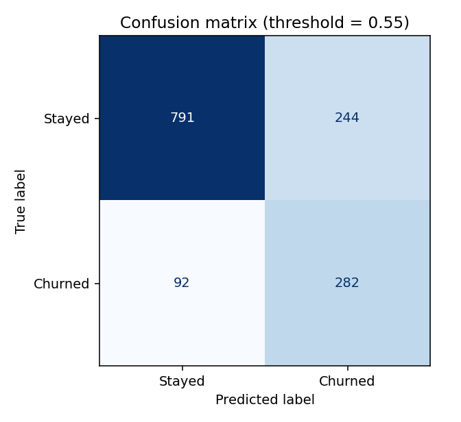
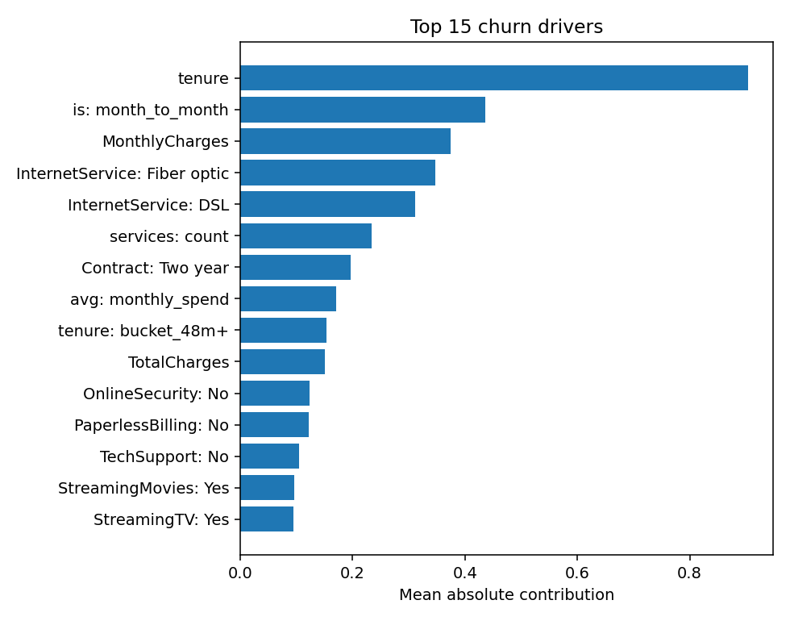
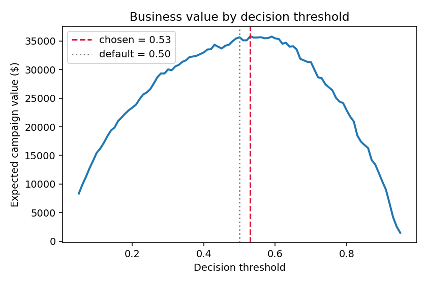

# ChurnIQ

**A churn-risk scoring system that ranks telecom customers by predicted churn probability, explains each score, and quantifies the revenue at stake.**

Live Application
https://churniq-predictor.streamlit.app/

Built with Python, SQL, scikit-learn, SHAP, Streamlit and Power BI.

> Replace this line with a GIF of the Streamlit app or Power BI report once you've recorded one — it is the first thing anyone looks at.

---

## The problem

Acquiring a telecom customer costs far more than keeping one, but retention teams can't call everybody. They need three things a spreadsheet can't give them:

1. **Who** is most likely to leave.
2. **Why** each of those customers is at risk, so the offer can be targeted.
3. **Whether** contacting them is worth the cost of the offer.

ChurnIQ answers all three. It scores every customer, attaches the top drivers behind each score via SHAP, and tunes its decision threshold to maximise the expected value of a retention campaign rather than defaulting to an arbitrary 0.5 cut-off.

## Architecture

```
 Raw CSV
    │
    ▼
 ingest.py ─────────► SQL database
    │                 ├── customers  (demographics, tenure, contract, services)
    │                 └── billing    (charges, payment method)
    ▼
 features.py ───────► JOIN + 7 engineered features ──► parquet
    │
    ▼
 train.py ──────────► 3 models compared (5-fold stratified CV)
    │                 └── best by ROC-AUC → threshold tuned for business value
    ▼
 models/churn_pipeline.pkl        (self-contained: preprocessing + model)
    │
    ▼
 predict.py ────────► predictions table in SQL  +  scored_customers.csv
    │                 └── probability, risk band, SHAP reasons, revenue at risk
    ▼
 ┌──────────────────┬──────────────────┐
 │  Power BI        │  Streamlit app   │
 │  (3-page report) │  (deployed)      │
 └──────────────────┴──────────────────┘
```

Training and inference are deliberately separate. `train.py` runs once and saves an artifact; `predict.py` loads that artifact and scores any file with the same schema. The model is never retrained at prediction time.

## Quickstart

```bash
git clone <your-repo-url> && cd churniq
python -m venv .venv && source .venv/bin/activate     # Windows: .venv\Scripts\activate
pip install -r requirements.txt

python run_pipeline.py          # generates data, ingests, trains, scores, plots
streamlit run src/app.py        # open the interactive app
```

That's it — the repo ships with a synthetic data generator, so it runs with no downloads and no credentials.

### Using the real dataset

The generator produces a **schema-identical synthetic** dataset (same 21 columns, same category values, realistic churn relationships) so the project is reproducible by anyone who clones it. To use the real data:

1. Download [IBM Telco Customer Churn](https://www.kaggle.com/datasets/blastchar/telco-customer-churn) from Kaggle.
2. Save it as `data/raw/Telco-Customer-Churn.csv`.
3. Run `python run_pipeline.py --skip-data`.

No code changes needed — `ingest.py` reads whichever CSV is at that path.

### Running stages individually

```bash
python src/make_sample_data.py --rows 7043   # synthetic data
python src/ingest.py                         # CSV  -> SQL tables (cleaned)
python src/features.py                       # SQL JOIN -> feature table
python src/train.py                          # compare, select, tune, save
python src/predict.py                        # score -> predictions table
python src/predict.py --csv new_batch.csv    # score a brand-new file
python src/evaluate.py                       # figures for the README
pytest -q                                    # tests
```

## Dashboard

Three pages in Power BI, built on the same `reports/scored_customers.csv` the pipeline writes. Open `dashboard/ChurnIQ.pbip` in Power BI Desktop to edit it, or `dashboard/ChurnIQ pbix File.pbix` to jump straight to the finished report. Because both read the pipeline's own output, the Revenue at Risk card ties back to `reports/metrics.json` to the dollar ($2,547,967).

**Page 1 — Executive Overview.** How big is the churn problem, and where is the revenue concentrated?



**Page 2 — Customer Risk List.** Which customers should retention call today, and what is driving each one's score?



**Page 3 — Model Performance.** How accurate is the model, where does it fail, and why is the cut-off 0.55 rather than 0.50?



### Why the report is committed as PBIP, not just PBIX

A `.pbix` is an opaque zip file. Git can store it, but it cannot diff or merge it — every edit reads as "binary file changed", and two people touching the same report produce a conflict nobody can resolve. So the report is committed as a **PBIP project** (`dashboard/ChurnIQ.pbip`), which Power BI Desktop saves as plain text: the report definition becomes one JSON file per page and per visual under `ChurnIQ.Report/definition/` (PBIR format), and the semantic model becomes **TMDL** under `ChurnIQ.SemanticModel/definition/` — a line-oriented format where every table, column and DAX measure is its own readable text block.

The practical payoff is that changing a measure is a one-line diff in `_Measures.tmdl`, moving a visual only touches that visual's `visual.json`, and a dashboard can go through code review like any other source. The `.pbix` is committed alongside purely as a convenience for opening the finished report. Machine-local files — `.pbi/localSettings.json`, `.pbi/cache.abf`, `.pbi/unappliedChanges.json` — are excluded in `.gitignore`, since they hold local paths and cached data rather than report definition.

## Results

All figures below come from `reports/metrics.json`, written by the run of `2026-08-17` on the synthetic dataset.

| Metric | Value |
|---|---|
| Rows | 7,043 |
| Churn rate | 26.5% |
| Best model | Logistic Regression |
| Test ROC-AUC | 0.842 |
| Test PR-AUC | 0.635 |
| Precision @ tuned threshold | 0.536 |
| Recall @ tuned threshold | 0.754 |
| Tuned threshold | 0.55 (vs. 0.50 default) |
| Revenue at risk | $2,547,967 |

Moving the threshold from 0.50 to 0.55 trades recall (0.794 → 0.754) for precision (0.499 → 0.536): 54 fewer wasted offers at the cost of 15 missed churners, which is the trade the value curve below prices out.

**Model comparison** (5-fold stratified CV on the training split):

| Model | CV ROC-AUC | Test ROC-AUC |
|---|---|---|
| Logistic Regression | 0.846 ± 0.011 | 0.842 |
| Random Forest | 0.842 ± 0.009 | 0.838 |
| Gradient Boosting | 0.832 ± 0.008 | 0.831 |

The spread between the best and worst CV ROC-AUC is 0.014, against per-model CV standard deviations of 0.008–0.011 — so the simplest model wins without giving up measurable ranking quality.








The confusion matrix is drawn at the tuned 0.55 threshold: of 1,409 test customers, 282 churners are caught and 92 missed, at the cost of 244 offers sent to customers who would have stayed.

## Design decisions worth explaining

**Why the data goes into SQL rather than staying in pandas.** The source CSV is flat; `ingest.py` splits it into `customers` and `billing` and the feature stage reads them back through a JOIN. This is an introduced split, not one inherent to the data — it exists so the project demonstrates schema design, joins and indexing rather than a single `read_csv`. Being upfront about that is better than pretending the source was normalised.

**Why accuracy is not the headline metric.** About 26% of customers churn, so a model that predicts "nobody churns" scores 74% accuracy and is worthless. The project reports ROC-AUC, PR-AUC, precision and recall, and shows the confusion matrix.

**Why the decision threshold isn't 0.5.** A 0.5 cut-off implicitly assumes a false positive and a false negative cost the same. In retention they don't: a false positive wastes one discount, a false negative loses a customer's remaining value. `business.py` sweeps every threshold and picks the one maximising campaign uplift versus doing nothing:

```
uplift = (value of retained customers) − (campaign spend)
```

Churn losses among customers we never contact are excluded deliberately — they happen in the do-nothing baseline too, so charging them against the campaign would double-count and push the optimiser toward flagging everybody. The full curve is plotted so the choice is visible rather than asserted.

**Why the model is a `Pipeline`, not a script of transformations.** Preprocessing lives inside the estimator, so the saved `.pkl` is self-contained and training and inference cannot drift apart. `OneHotEncoder(handle_unknown="ignore")` means an unseen category in new data is encoded as zeros instead of crashing — which is what makes the artifact reusable on any file with the same schema, not just the rows it was trained on. There's a test for exactly this.

**Why SHAP.** A risk score of 0.84 isn't actionable; "0.84 — month-to-month contract, 3 months tenure, electronic check" is. Every scored customer carries their top three risk drivers, and the Power BI call list surfaces them.

**Assumptions, stated plainly.** The offer cost, acceptance rate and 12-month value horizon in `config.yaml` are assumptions, not measurements. They drive the threshold and every currency figure in the project. Change them and the recommended threshold moves — the campaign planner in the Streamlit app is built to make that obvious.

## Engineered features

| Feature | Why |
|---|---|
| `tenure_bucket` | Churn risk is non-linear in tenure; buckets capture the early cliff |
| `avg_monthly_spend` | `TotalCharges / tenure` — detects spend drifting from the current bill |
| `services_count` | Bundling is strongly protective against churn |
| `is_month_to_month` | Typically the single strongest churn signal in this dataset |
| `has_auto_payment` | Electronic-check payers churn far more than auto-pay customers |
| `charge_ratio` | Current bill vs. lifetime average — a recent price-increase signal |
| `is_new_customer` | First-year customers behave differently from the rest |

## Project structure

```
churniq/
├── config.yaml                  # every path and parameter — nothing hardcoded in src/
├── run_pipeline.py              # one-command reproduction
├── requirements.txt
├── src/
│   ├── config.py                # config loading + path resolution
│   ├── db.py                    # SQLAlchemy, with a stdlib sqlite3 fallback
│   ├── make_sample_data.py      # schema-identical synthetic dataset
│   ├── ingest.py                # CSV -> cleaned, normalised SQL tables
│   ├── features.py              # SQL JOIN -> engineered feature table
│   ├── pipeline.py              # ColumnTransformer + estimator construction
│   ├── business.py              # revenue at risk, threshold tuning, campaign sim
│   ├── train.py                 # compare, cross-validate, tune, save artifact
│   ├── explain.py               # SHAP explanations (with graceful fallback)
│   ├── predict.py               # load artifact, score, write to SQL
│   ├── evaluate.py              # ROC / PR / confusion / drivers figures
│   └── app.py                   # Streamlit app
├── dashboard/
│   └── POWERBI_GUIDE.md         # DAX measures + 3-page build guide
├── tests/
│   └── test_pipeline.py         # 13 tests over cleaning, features, business logic
├── notebooks/
│   └── 01_eda.ipynb             # exploration — not the deliverable
└── reports/
    ├── metrics.json
    ├── scored_customers.csv
    └── figures/
```

## Deployment

The ChurnIQ application is deployed on Streamlit Community Cloud.
Live Application: https://churniq-predictor.streamlit.app/
The deployed application runs from committed model and scoring artifacts, allowing it to operate without requiring the local SQLite database.

**Streamlit app** — free on [Streamlit Community Cloud](https://share.streamlit.io): connect the GitHub repo, set the entrypoint to `src/app.py`. Commit `models/churn_pipeline.pkl` and `reports/scored_customers.csv` so the cloud instance has data without needing a database.

**Database** — SQLite works out of the box. For a hosted Postgres (Supabase or Neon, both free tier), set `DATABASE_URL` in `.env` and `pip install psycopg2-binary`; nothing else changes.

**Power BI** — `.pbix` is a binary format that can only be authored in Power BI Desktop, so it isn't generated by the pipeline. `dashboard/POWERBI_GUIDE.md` has the full build: connection setup, ~20 DAX measures, and the three-page layout. Commit the `.pbix` and screenshots.

## Limitations and what I'd do next

Being straight about these is deliberate — every one of them is a question an interviewer might ask.

- **The default dataset is synthetic.** Relationships are realistic and the schema matches exactly, but reported metrics should come from the real Kaggle file before you quote them anywhere.
- **No temporal validation.** The Telco dataset is a snapshot with no timestamps, so there's no train-on-past / test-on-future split. With real data I'd validate across time periods, because a random split leaks future information.
- **The business assumptions are guesses.** Offer cost and acceptance rate should come from an actual retention team, ideally measured by holdout testing.
- **No monitoring.** A production version needs drift detection on the input distribution and scheduled retraining.
- **The customers/billing split is synthetic**, as noted above.
- **Next:** a FastAPI endpoint for real-time scoring, a proper experiment log (MLflow) once there are more than a handful of runs, and an uplift model rather than a churn model — churn probability isn't the same as *persuadability*, and targeting the customers most likely to leave isn't the same as targeting the ones an offer would actually change.

## Tech stack

Python 3.10+ · pandas · scikit-learn · SQLAlchemy / SQLite / Postgres · SHAP · matplotlib · Plotly · Streamlit · Power BI · pytest

---

Built by [Ashmit Kuhikar](https://github.com/) — B.Tech CSE, SRM Institute of Science and Technology (2027).
